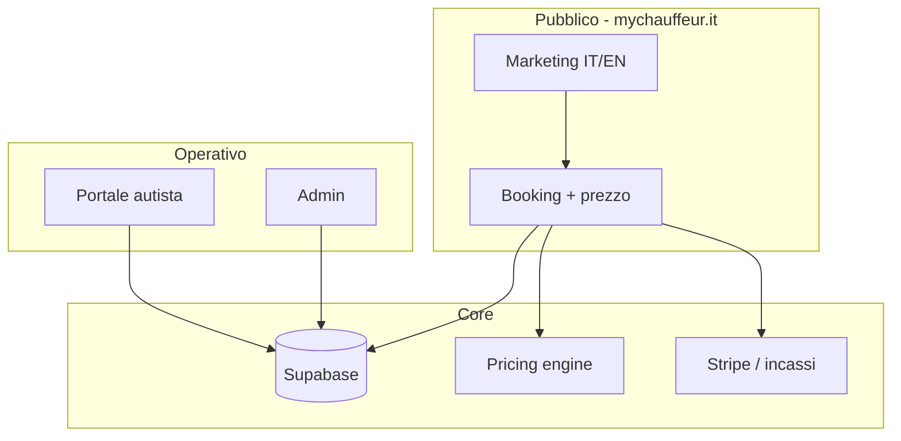

# MyChauffeur Platform Map

Ultimo aggiornamento: 2026-06-24  
Fase corrente: **0 — Ordine e baseline**  
Progetto principale: `mychauffeur-new` → **www.mychauffeur.it**

## Visione

Una piattaforma NCC premium (stile Blacklane / Transfeero) con fermate opzionali (stile Daytrip), gestione viaggi, autisti e pagamenti.  
**Sito pubblico** + **gestionale** nello stesso prodotto nel tempo.

## Architettura target

## Cosa esiste oggi

| Modulo | mychauffeur-new | daytrip-clone (archivio moduli) |
|--------|-----------------|----------------------------------|
| Sito marketing IT/EN | ✅ | parziale (Umbria) |
| GDPR / cookie | ✅ | — |
| Form richiesta | ✅ (JSON + email) | — |
| Prezzo istantaneo | ❌ | ✅ |
| DB viaggi / quote | ❌ | ✅ |
| Admin | ❌ | ✅ |
| Portale autista | ❌ | ✅ parziale |
| Pagamenti Stripe | ❌ | ❌ (roadmap) |

**Repo attivo:** `/Users/cristiancagnoni/progetti/mychauffeur-new`  
**GitHub:** https://github.com/CrisCag/mychauffeur-new  
**Archivio gestionale:** `/Users/cristiancagnoni/progetti/daytrip-clone` (non cancellare)  
**Supabase:** MyChauffeurUmbria.it — in pausa (restore in Fase 2)

## Roadmap fasi

| Fase | Obiettivo | Definition of Done |
|------|-----------|------------------|
| **0** | Ordine, mappa, git allineato | Questo file + HANDOFF + commit push |
| **1** | Sito produzione (lead) | Form → email; deploy staging/prod |
| **2** | Core viaggi + prezzo | Calcolo € + trip in DB |
| **3** | Admin | Pannello prenotazioni e tariffe |
| **4** | Autisti + dispatch | Offerte, assegnazione, stati viaggio |
| **5** | Pagamenti | Stripe acconto/saldo |
| **6** | Verticale Umbria | Stesso backend, brand/POI Umbria |

## Prossimi 3 step (capitano)

1. Verificare sito in locale: `npm run dev -- --port 3002` → `/it`
2. Commit + push di tutto il lavoro locale non ancora su GitHub
3. `.env.local`: Google Maps + SMTP (quando hai le chiavi)

## Protocollo «mi fermo»

Quando scrivi **mi fermo**, l’agente deve:

1. `git commit` (se ci sono cambi) con messaggio `checkpoint: fase X - data`
2. `git push` su `origin/main`
3. Copia backup in `backups/YYYYMMDD-HHMM-mi-fermo/` (senza `node_modules`, `.next`)
4. Aggiornare sezione checkpoint sotto
5. Rispondere con: fase, commit hash, path backup, 3 righe per ripartire

## Checkpoint sessione

| Data | Fase | Commit | Backup | Note ripartenza |
|------|------|--------|--------|-----------------|
| 2026-06-24 | 0 avviata | — | — | Mappa creata; commit push da fare |
