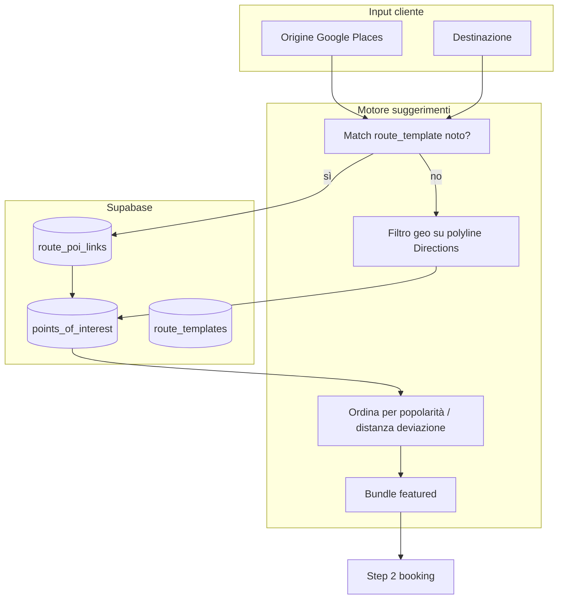
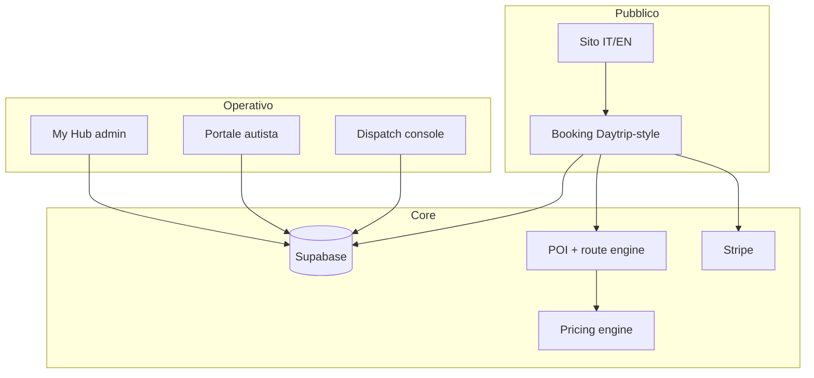

# MyChauffeur Platform Map

Ultimo aggiornamento: 2026-06-18  
Fase corrente: **2a — Core booking (prezzo + fermate Daytrip)**  
Progetto principale: `mychauffeur-new` → **www.mychauffeur.it**

## Visione (definitiva)

**Piattaforma ride-hailing NCC** con:

- **Filosofia Daytrip** — prenotazione anticipata, door-to-door, prezzo upfront, fermate turistiche opzionali, tratte lunghe
- **Dispatcher integrato** — coda viaggi, assegnazione, telefono, negoziazione autisti (stile Onde Operator)
- **Hub operativo** — tariffe, autisti, veicoli, report, pagamenti (stile Onde My Hub)

Non è taxi istantaneo Uber. È **transfer prenotato + rete autisti + centro dispatch**.

## Organizzazione progetto (scelta capitano)

| Decisione | Scelta |
|-----------|--------|
| **Un solo repo attivo** | `mychauffeur-new` — tutto converge qui |
| **Archivio moduli** | `daytrip-clone` — import selettivo, non cancellare |
| **Database** | Supabase (restore progetto MyChauffeurUmbria) |
| **Hosting** | Aruba: dominio/email; app su Cloud Server o Application Platform |
| **Joomla live** | Backup completo prima del cutover DNS |
| **Dev locale** | porta **3002** |

### Struttura moduli (target in mychauffeur-new)

```
mychauffeur-new/
├── app/[locale]/          # Sito pubblico IT/EN
├── app/booking/           # Funnel prenotazione (da daytrip-clone)
├── app/admin/             # Hub + dispatch
├── app/driver/            # Portale autista
├── src/platform/
│   ├── pricing/           # tripPricing, calculate API
│   ├── poi/               # catalogo fermate + filtro percorso
│   ├── dispatch/          # offerte, assign, negotiation
│   └── booking/           # snapshot, quote, bookTrip
└── supabase/migrations/   # schema unificato
```

Import da `daytrip-clone` **a blocchi**, non copia totale del repo.

## Le 5 superfici (matrice Onde → MyChauffeur)

| Onde | MyChauffeur | Priorità | Stato |
|------|-------------|----------|-------|
| Customer app | Web IT/EN → PWA → app nativa | P0 | Sito ~80% |
| Driver app | Portale web `/driver` | P1 | Clone ~60% |
| Operator / Dispatch | Console admin operations | P1 | Clone ~50% |
| Partner web | Link B2B hotel/aeroporti | P3 | ❌ |
| My Hub | Admin tariffe, autisti, report | P1 | Clone parziale |

## Come Daytrip propone le fermate (studio)

### Cosa fa Daytrip in prenotazione

1. Cliente inserisce **origine + destinazione + data**
2. Al **passo 2** vede solo fermate **consigliate lungo il percorso** (non tutte le attrazioni d’Italia)
3. Ogni fermata ha: **foto, descrizione editoriale, prezzo supplemento, durata suggerita** (modificabile)
4. Pulsante **«fermate più popolari»** — bundle pre-selezionato
5. Fermata non in lista → **preventivo custom** (form / email)
6. Il prezzo totale si **ricalcola** aggiungendo soste (deviazione + attesa)

Fonte ufficiale: [help Daytrip — sightseeing stops](https://daytrip.ladesk.com/535181-How-do-I-add-sightseeing-stops-to-a-trip)

### Da dove attinge Daytrip (modello reale)

Daytrip non usa Google Places “a caso”. Usa un **catalogo curato interno**:

| Livello | Contenuto | Chi lo gestisce |
|---------|-----------|-----------------|
| **1. Catalogo POI** | Nome, lat/lng, foto, testo, tag (UNESCO, castello…), prezzo sosta, minuti consigliati | Team editoriale / ops |
| **2. Rotte commerciali** | Coppie città/zone ad alto traffico (es. Roma → Firenze) | Product + SEO |
| **3. Associazione rotta ↔ POI** | Quali fermate sono “sul percorso” per quella tratta, ordine, popolarità | Ops (manuale) + regole geo |
| **4. Filtro dinamico** | Indirizzi liberi A→B: mostra solo POI entro corridoio stradale | Algoritmo su polyline Google Directions |
| **5. Eccezioni** | Richiesta custom se POI fuori catalogo | Dispatch umano |

In sintesi: **contenuto curato a mano** + **filtro geografico sul percorso reale** + **bundle popolari**.

### Cosa abbiamo oggi in daytrip-clone (gap)

| Funzione | Clone | Daytrip |
|----------|-------|---------|
| Tabella `points_of_interest` | ✅ | ✅ |
| Admin CRUD POI + immagini | ✅ | ✅ (loro CMS) |
| Prezzo sosta + deviazione | ✅ | ✅ |
| Funnel step 2 fermate | ✅ | ✅ |
| **Filtro POI per rotta A→B** | ❌ mostra **tutti** i POI | ✅ solo “on the way” |
| **Tabelle rotta / corridoio** | ❌ | ✅ (interno) |
| **Bundle “più popolari”** | ❌ | ✅ |
| **Preventivo custom** | parziale (email) | ✅ form dedicato |
| Geo validazione | solo Umbria | globale per rotta |

**Priorità Fase 2b:** implementare filtro percorso + catalogo rotte prima di scalare nazionale.

## Architettura dati fermate (target MyChauffeur)



### Tabelle nuove (Fase 2b)

**`route_templates`** — tratte commerciali note

- `id`, `slug`, `origin_zone` (testo o poligono), `destination_zone`
- `origin_city`, `destination_city` (per SEO e match rapido)
- `active`, `sort_priority`

**`route_poi_links`** — fermate consigliate per tratta

- `route_template_id`, `poi_id`
- `sort_order`, `is_featured`, `popularity_score`
- `max_detour_minutes` (opzionale)

**`points_of_interest`** — già esistente, estendere con:

- `region` / `country`
- `popularity_score`
- `is_national` (visibile su tratte lunghe)

### API suggerimenti (contratto)

`POST /api/trips/suggest-stops`

```json
{
  "origin": "Roma Termini",
  "destination": "Firenze SMN",
  "originLat": 41.9,
  "originLng": 12.5,
  "destinationLat": 43.77,
  "destinationLng": 11.25
}
```

Risposta:

```json
{
  "routeTemplateId": "uuid-or-null",
  "featuredBundle": ["poi-id-1", "poi-id-2"],
  "stops": [
    {
      "id": "...",
      "name": "Orvieto",
      "base_stop_price": 45,
      "suggested_duration_minutes": 90,
      "deviation_time_minutes": 25,
      "tags": ["UNESCO"],
      "matchReason": "on_route_template"
    }
  ],
  "customStopAvailable": true
}
```

Logica:

1. Se origine/destinazione matchano un `route_template` → POI da `route_poi_links` ordinati
2. Altrimenti → polyline Directions + POI entro **X km** dal corridoio (es. 15 km) e deviazione **≤ Y min**
3. In cima: `is_featured` + bundle “più popolari”
4. Sempre: link **«Fermata non in lista? Richiedi preventivo»**

## Architettura target completa



## Cosa esiste oggi

| Modulo | mychauffeur-new | daytrip-clone |
|--------|-----------------|---------------|
| Sito marketing IT/EN | ✅ | parziale |
| GDPR / cookie | ✅ | — |
| Form richiesta | ✅ (JSON + email) | — |
| Prezzo istantaneo | ❌ | ✅ |
| Catalogo POI | ❌ | ✅ (senza filtro rotta) |
| Filtro fermate per percorso | ❌ | ❌ |
| DB viaggi / quote | ❌ | ✅ |
| Admin + dispatch | ❌ | ✅ |
| Portale autista | ❌ | ✅ parziale |
| Pagamenti Stripe | ❌ | ❌ |

**Repo:** `/Users/cristiancagnoni/progetti/mychauffeur-new`  
**GitHub:** https://github.com/CrisCag/mychauffeur-new  
**Archivio:** `/Users/cristiancagnoni/progetti/daytrip-clone`  
**Supabase:** MyChauffeurUmbria.it — in pausa (restore Fase 2a)

## Roadmap fasi (aggiornata)

| Fase | Obiettivo | Definition of Done |
|------|-----------|-------------------|
| **0** | Ordine, mappa, git | ✅ |
| **1** | Sito live + backup Joomla | Deploy staging Aruba; Akeeba backup |
| **2a** | Core booking | Import pricing + funnel; Supabase restore; quote in DB |
| **2b** | **Fermate Daytrip** | `route_templates`, `suggest-stops`, filtro geo, bundle popolari |
| **3** | Dispatch + Hub | Coda operations, assign, tariffe, POI admin |
| **4** | Rete autisti | Offerte for_you/public/early, earnings |
| **5** | Pagamenti | Stripe cliente + settlement autista |
| **6** | Verticale Umbria | POI e regole locali sullo stesso backend |
| **7** | App native / partner B2B | Opzionale |

## Prossimi 3 step (capitano — ordine scelto)

1. **Restore Supabase** + import moduli pricing/booking da daytrip-clone in mychauffeur-new
2. **Migrazione** `route_templates` + `route_poi_links` + API `suggest-stops`
3. **Seed iniziale** 5 tratte Italia (es. FCO→Roma, Roma→Firenze, Milano→Como, Napoli→Costiera, Perugia→Assisi) con POI curati

## Protocollo «mi fermo»

1. `git commit` con `checkpoint: fase X - data`
2. `git push` su `origin/main`
3. Backup in `backups/YYYYMMDD-HHMM-mi-fermo/`
4. Aggiornare checkpoint sotto
5. Rispondere: fase, commit, path backup, 3 righe ripartenza

## Checkpoint sessione

| Data | Fase | Commit | Backup | Note ripartenza |
|------|------|--------|--------|-----------------|
| 2026-06-24 | 0 ✅ | `4b57e9a` | — | Push GitHub ok |
| 2026-06-18 | 2a pianificata | — | — | Visione Onde+Daytrip+dispatch; POI engine definito |
