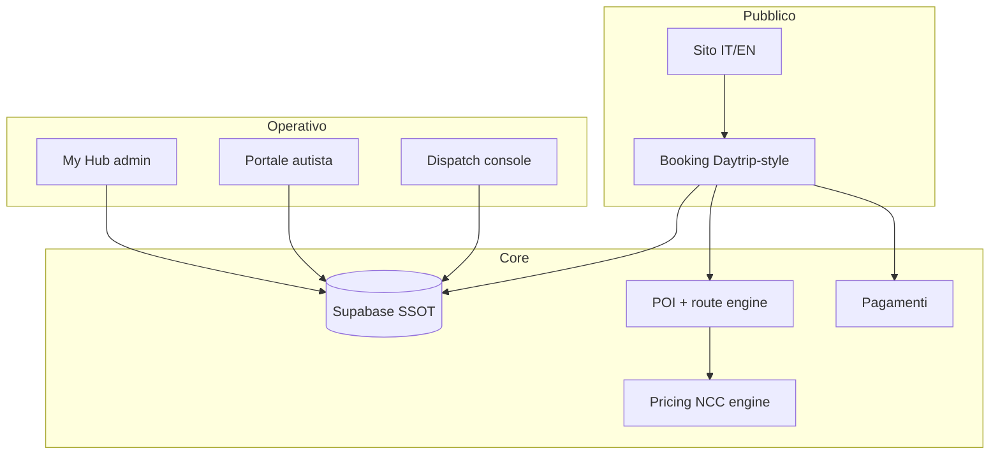

# MyChauffeur Platform Map

**Documento tecnico e operativo di riferimento** — repository `mychauffeur-new` → **www.mychauffeur.it**

| Campo | Valore |
|-------|--------|
| Ultimo aggiornamento | **2026-07-07** |
| Fase corrente (reale) | **2a avanzata** — core booking Daytrip funzionante in locale; fondamenta produzione assenti |
| Dev locale | `npm run dev` → **http://127.0.0.1:3002** |
| Allegati | [`docs/NCC_TARIFF_REQUIREMENTS.md`](docs/NCC_TARIFF_REQUIREMENTS.md), [`docs/DECISIONS_PENDING.md`](docs/DECISIONS_PENDING.md) |

---

## Visione

**Piattaforma NCC / transfer prenotato** (non taxi istantaneo):

- **Filosofia Daytrip** — door-to-door, prezzo upfront, fermate turistiche opzionali, tratte lunghe
- **Dispatcher integrato** — coda viaggi, assegnazione, negoziazione (stile Onde Operator)
- **Hub operativo** — tariffe, autisti, veicoli, report, pagamenti (stile Onde My Hub)

---

## Stack e architettura (stato reale)

| Layer | Tecnologie / percorsi |
|-------|------------------------|
| Frontend | Next.js 16 App Router, React 19, TypeScript, Tailwind 4, shadcn/ui, next-intl |
| Backend | Route Handlers in `app/api/*` — nessun server separato |
| Logica dominio | `lib/platform/*`, `lib/booking-*`, `types/*` |
| Mappe | Google Maps Platform (Places New server-side, Directions, Geocoding, mappa client) |
| Email | Nodemailer (SMTP opzionale) |
| DB target | Supabase (`@supabase/supabase-js`) |
| Persistenza dev | File JSON in `data/` |
| i18n | Solo **IT** e **EN** (`lib/i18n-config.ts`, `messages/it.ts`, `messages/en.ts`) |
| Test | **Nessuno** (no Jest/Vitest/Playwright in `package.json`) |

### Struttura repository (effettiva vs target)

```
mychauffeur-new/
├── app/[locale]/              # Sito pubblico, /book, /driver
├── app/api/                   # 10 route API (vedi sotto)
├── components/                # UI, booking, driver, gdpr
├── lib/platform/              # pricing, POI, trip-ops, places, route-preview
├── data/                      # JSON runtime (dev)
├── supabase/migrations/       # 1 migration trip-ops (202606240001)
├── messages/                  # i18n IT/EN
├── scripts/backup-project.sh    # Backup locale
└── docs/                      # NCC tariff, decisioni pending
```

**Target non ancora creato:** `app/admin/`, `lib/platform/dispatch/`, migration booking/quotes/POI complete nel repo.

### API esistenti

| Route | Scopo |
|-------|--------|
| `POST /api/trips/calculate` | Preventivo multi-veicolo |
| `POST /api/booking` | Salva richiesta + email + trip operativo |
| `GET /api/points-of-interest` | POI suggeriti (limitato) |
| `POST /api/route-preview` | Mappa percorso |
| `GET /api/places/autocomplete` | Suggerimenti indirizzo (Places New) |
| `GET /api/places/details` | Dettaglio luogo |
| `GET /api/wait-time-rates` | Config attesa fermate |
| `GET /api/comfort-mode` | Config VIP No Rush |
| `GET/PATCH/POST /api/trip-ops` | Viaggi operativi (dev JSON) |
| `GET/PATCH/POST /api/trip-ops/[id]` | Dettaglio corsa autista |

**Middleware:** solo redirect legacy in `proxy.ts` — **nessuna auth**.

---

## Cosa esiste oggi

Legenda: ✅ funzionante · 🟡 MVP incompleto · 📋 pianificato · ❌ assente · ⚠️ debito tecnico

### Funzionalità implementate e funzionanti

| Area | Evidenza |
|------|----------|
| Sito marketing IT/EN | `app/[locale]/page.tsx`, sezioni hero/fleet/trust |
| GDPR / cookie consent | `components/gdpr/*`, blocco mappe senza consenso |
| Widget prenotazione homepage | `components/sections/booking-widget.tsx` |
| Autocomplete indirizzi | `components/booking/address-autocomplete.tsx` + `app/api/places/*` |
| Calcolo preventivo istantaneo | `app/api/trips/calculate`, `lib/platform/trip-pricing.ts` |
| Funnel `/book` 3 step | `components/booking/book-flow-client.tsx` — fermate → veicolo → contatto |
| Fermate catalogo + custom (max 10) | `tripStops`, `static-pois.ts`, ricalcolo prezzo |
| Mappa percorso + segnaposti | `trip-route-map.tsx`, `route-preview.ts` |
| VIP No Rush (+18%) | `comfort-mode-config.json`, calculate API |
| Salvataggio richiesta | `app/api/booking` → `data/booking-requests.json` |
| Email richiesta (se SMTP) | `lib/booking-email.ts` |
| Ritorno viaggio (round trip) | Widget + calculate merge |
| Layout riepilogo laterale (Daytrip-style) | `booking-summary-panel.tsx` |

### MVP presenti ma incompleti

| Area | Gap | File principali |
|------|-----|-----------------|
| Portale autista | Nessun login; `DEFAULT_DRIVER_ID`; API aperte | `app/[locale]/driver/*`, `trip-ops-store.ts` |
| Timer attesa pickup/fermate | Logica in codice; persistenza JSON; no app cliente | `wait-timer.ts`, migration SQL non applicata |
| POI suggeriti | Nessun filtro “on route”; Supabase `select * limit 20` | `app/api/points-of-interest/route.ts` |
| Quote in database | `insertQuotesBatch` solo se Supabase configurato | `lib/platform/quotes.ts` |
| Deviazione percorso nel prezzo | `costoDeviazione` sempre 0 | `trip-pricing.ts` |
| Allineamento veicoli | Homepage `other` vs book `luxury` | `booking-widget.tsx`, `book-flow-client.tsx` |
| Documentazione handoff | `HANDOFF.md` obsoleto (fase deploy vs 2a) | `HANDOFF.md` |
| `PLATFORM_MAP` precedente | Tabella “cosa esiste” non aggiornata | — |

### Funzionalità pianificate (roadmap / architettura)

| Area | Riferimento |
|------|-------------|
| `route_templates` + `suggest-stops` + filtro geo POI | Sezione Daytrip sotto; Fase 1–2 |
| Admin / dispatch (`app/admin/`) | Fase 2 roadmap |
| Auth Supabase + RLS | Fase 2 |
| Pagamenti Stripe | Fase 3 |
| Partner portal completo | Fase 4 (scope business da confermare) |
| Motore tariffario NCC completo | Fase 3 + [`docs/NCC_TARIFF_REQUIREMENTS.md`](docs/NCC_TARIFF_REQUIREMENTS.md) |
| App cliente tracking + extra minuti | Migration `stop_time_purchases` |
| Notifiche SMS/push | Fase 4–5 |
| Lingue ES/FR/DE/RU | Fase 5 — **non previste** in codice |

### Funzionalità assenti

| Area |
|------|
| Autenticazione (qualsiasi ruolo) |
| Pannello admin / gestionale UI |
| Portale partner (registrazione, documenti, flotta) |
| Pagamenti online / webhook / rimborsi |
| Assegnazione dispatcher (coda, offerte, accept/reject) |
| Test automatici |
| Logging centralizzato / APM |
| RLS Supabase |
| Tabelle `booking_requests`, `quotes`, `pricing_rules`, `points_of_interest` **nel repo migrations** (attese da DB legacy / daytrip-clone) |

### Debito tecnico rilevante

| Voce | Impatto |
|------|---------|
| Dual persistenza JSON + Supabase opzionale | Dati divergenti tra ambienti |
| `book-flow-client.tsx` ~970 righe | Difficile evolvere funnel |
| API `trip-ops` senza protezione | Rischio sicurezza in staging/prod |
| Chiave Google esposta lato client (`NEXT_PUBLIC_*`) | Normale per Maps; va ristretta per dominio |
| Lavoro non committato (sessioni recenti) | Perdita storico / deploy |
| Nessun contratto API formale (OpenAPI) | Regressioni silenti |
| Migration Supabase progetto in pausa | Schema ops non in DB reale |

---

## Fondamenta mancanti prima della produzione

**Obbligatorie** prima di esporre dispatch, autisti o pagamenti al pubblico.

| Fondamento | Stato | Azione target | Priorità |
|------------|-------|---------------|----------|
| **Autenticazione** | ❌ | Supabase Auth (o IdP); sessioni admin/driver | Critica |
| **Ruoli e permessi** | ❌ | RBAC: admin, dispatcher, driver, partner | Critica |
| **Middleware** | ❌ | Protezione route `/admin`, `/driver`, API ops | Critica |
| **Protezione API** | ❌ | API key interna, JWT, o disabilitare ops in prod | Critica |
| **RLS Supabase** | ❌ | Policy per trip, wait_sessions, booking | Alta |
| **Test automatici** | ❌ | Unit pricing; integration API; smoke E2E booking | Critica |
| **Logging / observability** | ❌ | Structured logs, error tracking (es. Sentry) | Alta |
| **Backup e recovery** | 🟡 | Script `scripts/backup-project.sh`; manca policy prod DB | Alta |
| **JSON → Supabase SSOT** | 🟡 | Piano sotto; oggi JSON è source of truth in dev | Critica |

---

## Modello operativo MyChauffeur

Ruoli previsti dalla piattaforma. **Nessuno implementato** come login oggi.

| Ruolo | Accesso previsto | Dati visibili | Azioni consentite | Dipendenze tecniche |
|-------|------------------|---------------|-------------------|---------------------|
| **Admin** | `/admin` (futuro), login Supabase | Tutto: prenotazioni, corse, tariffe, POI, utenti, report | CRUD tariffe/POI, override prezzi, gestione utenti, audit | Auth, RLS admin, admin UI |
| **Dispatcher** | Console operations (subset admin) | Coda richieste, corse, autisti, partner, stato pagamenti | Assegnare corse, modificare stato, contatto cliente/autista, no-show review | Auth, trip ops DB, notifiche |
| **Driver diretto** | `/[locale]/driver`, app futura | Proprie corse assegnate, timer attesa, GPS proprio | Avanzamento stati, no-show + prove, ping GPS | Auth driver, RLS per `driver_id`, trip-ops API protetta |
| **Partner NCC** | Portale partner (futuro) | Corse del proprio network, documenti, compensi | Gestire sub-driver, accettare/rifiutare batch, documenti | Partner schema, auth, settlement |
| **Driver partner** | App driver con `partner_id` | Solo corse assegnate dal partner | Stessi stati del driver diretto, scope limitato | Auth + RLS partner scope |
| **Cliente B2C** | Sito pubblico, link tracking (futuro) | Propria prenotazione, autista, timer | Prenotare, pagare, acquistare extra minuti, cancellare | Booking DB, pagamenti, customer app |
| **Cliente / agenzia B2B** | Widget + email `bypartners@` (oggi); portale B2B (futuro) | Richieste B2B, net rate, fatturazione | Richiesta gruppi, multi-veicolo, account agenzia | B2B flag oggi in `booking-widget`; net rate in Fase 3 |

---

## Motore tariffario NCC

**Requisito ufficiale di prodotto** — dettaglio completo in [`docs/NCC_TARIFF_REQUIREMENTS.md`](docs/NCC_TARIFF_REQUIREMENTS.md).

### Tre livelli economici (obbligatori a regime)

1. **Prezzo al cliente** — preventivo e fattura  
2. **Costo assegnato** — driver diretto o partner  
3. **Margine / commissioni** — piattaforma e (se applicabile) partner  

### Implementato oggi (solo Daytrip semplificato)

`base_fare + km + soste + attesa fermate + moltiplicatore veicolo + VIP 18%` — vedi `lib/platform/trip-pricing.ts`.

### Da configurare (non in codice)

Minimo servizio, km/ore inclusi, extra, notturno/festivo su transfer, pedaggi, ZTL, parcheggi, traghetti, rientro a vuoto, diarie, disposal, multi-giorno, minibus/coach, margine minimo, preventivo manuale — tabella priorità nell’allegato NCC.

---

## Piano di migrazione dati JSON → Supabase

Obiettivo: **Supabase come single source of truth** in produzione; JSON solo fallback dev locale opzionale.

### 1. Inventario file JSON attuali

| File | Contenuto | Writer attuale | Reader | Git |
|------|-----------|----------------|--------|-----|
| `data/booking-requests.json` | Richieste prenotazione | `lib/booking-requests.ts` | Sync trip-ops | Ignorato |
| `data/operational-trips.json` | Viaggi operativi, wait, GPS | `lib/platform/trip-ops-store.ts` | `/api/trip-ops`, driver UI | Ignorato |
| `data/wait-time-rates.json` | Tariffe attesa fermate | Manuale / deploy | `wait-time-pricing.ts`, API | Versionato |
| `data/comfort-mode-config.json` | VIP markup | Manuale | `comfort-mode.ts`, API | Versionato |

**Nota:** `sessionStorage` (`lib/booking-flow-storage.ts`) non è migrazione DB — resta stato client funnel.

### 2. Tabelle mancanti nel repo (da definire / importare)

| Tabella | Stato repo | Uso codice già presente |
|---------|------------|-------------------------|
| `quotes` | Non in migration repo | `lib/platform/quotes.ts` |
| `pricing_rules` | Non in migration repo | `trip-pricing.ts` |
| `points_of_interest` | Non in migration repo | `poi-query.ts`, POI API |
| `booking_requests` | Non in migration repo | Da creare (oggi JSON) |
| `operational_trips` + correlate | In `202606240001_*.sql` | trip-ops (parziale) |
| `route_templates`, `route_poi_links` | Solo in questa doc (Fase POI) | Pianificato |
| `users`, `drivers`, `partners`, `vehicles` | Non in repo | Auth Fase 2 |
| `payments`, `settlements` | Non in repo | Fase 3 |

**Incertezza:** il progetto Supabase **MyChauffeurUmbria** potrebbe già contenere `quotes`, `pricing_rules`, `points_of_interest` da daytrip-clone — **verificare su dashboard** dopo restore; non deducibile solo dal repo.

### 3. Repository / data-access layer

Introdurre (pianificato, non implementato):

- `lib/platform/repositories/booking-repository.ts`
- `lib/platform/repositories/trip-ops-repository.ts`
- `lib/platform/repositories/quote-repository.ts`

Interfacce comuni; implementazioni `Json*Repository` (dev) e `Supabase*Repository` (prod).

### 4. Dual-write temporaneo

1. `saveBookingRequest` scrive JSON **e** Supabase  
2. Log discrepanze (id, timestamp, hash payload)  
3. Feature flag `BOOKING_STORAGE= dual | supabase | json`

### 5. Verifica coerenza

- Script confronto count + campione record  
- Job giornaliero pre-switch  
- Criterio: 0 errori per N giorni in staging

### 6. Switch progressivo

1. Read da Supabase, write dual  
2. Read/write solo Supabase  
3. JSON read-only backup  
4. Rimuovere writer JSON in produzione

### 7. Rimozione JSON in produzione

- `data/*.json` esclusi da deploy (o vuoti)  
- `.gitignore` per dati runtime se necessario  
- Documentare rollback: restore Supabase backup

---

## Come Daytrip propone le fermate (target prodotto)

*(Invariato come studio — implementazione parziale)*

1. Origine + destinazione + data  
2. Solo fermate **sul percorso**  
3. Foto, testo, prezzo, durata modificabile  
4. Bundle “più popolari”  
5. Custom → preventivo  
6. Prezzo live  

### Gap mychauffeur-new vs target

| Funzione | Stato |
|----------|--------|
| Funnel step fermate | 🟡 |
| POI statici + Supabase fallback | 🟡 |
| Filtro per rotta A→B | ❌ |
| `route_templates` / `route_poi_links` | 📋 |
| API `POST /api/trips/suggest-stops` | 📋 |
| Bundle popolari | ❌ |
| Admin CRUD POI | ❌ |

Schema target e contratto API: vedere sezioni precedenti in questo file (mermaid + JSON esempio) — ancora validi come specifica.

---

## Architettura target


```mermaid
flowchart TB
  subgraph public [Pubblico]
    MKT[Sito IT/EN]
    BOOK[Booking Daytrip-style]
  end
  subgraph ops [Operativo]
    DISP[Dispatch console]
    DRV[Portale autista]
    HUB[My Hub admin]
  end
  subgraph core [Core]
    DB[(Supabase SSOT)]
    POIENG[POI + route engine]
    PRICE[Pricing NCC engine]
    PAY[Pagamenti]
  end
  MKT --> BOOK
  BOOK --> POIENG --> PRICE
  BOOK --> DB
  DISP --> DB
  DRV --> DB
  HUB --> DB
  BOOK --> PAY
```

---

## Roadmap (ordine ufficiale)

### Fase 0 — Stabilizzazione e sicurezza minima

| Voce | Definition of Done |
|------|-------------------|
| Documentazione allineata | `PLATFORM_MAP.md`, allegati, `HANDOFF.md` aggiornati |
| Test unitari | `trip-pricing`, `wait-time-pricing`, `wait-timer` |
| Test API | calculate, booking, places |
| Smoke test booking | Homepage → `/book` → submit (Playwright o manuale documentato) |
| Protezione API sensibili | `trip-ops` disabilitato in `NODE_ENV=production` (`lib/api/trip-ops-production-guard.ts`) |
| Git hygiene dati runtime | `.gitignore` + `data/README.md`; `operational-trips.json` ignorato |
| Rate limit API pubbliche | In-memory temporaneo (`lib/api/memory-rate-limit.ts`) su booking, calculate, places, route-preview |
| Hardening booking | Honeypot, validazione contatti, `luxury` allineato, verifica `quotedPrice` server-side |
| Backup e Git | `scripts/backup-project.sh`; protocollo commit checkpoint |

**Stato:** protezioni baseline sicurezza ✅ (branch `fase-0/stabilizzazione-sicurezza-baseline`); test automatici ❌.

### Fase 1 — Supabase come database unico

- Restore progetto Supabase  
- Tabelle: booking, quote, clienti, pricing_rules, POI, trip operations  
- Migrazione progressiva JSON → Supabase (piano sopra)  
- Coda richieste interna minima (anche read-only admin)

### Fase 2 — Auth, ruoli, RLS e admin

- Supabase Auth  
- Ruoli admin, dispatcher, driver  
- Middleware Next.js  
- RLS  
- Login portale driver  
- `app/admin/` iniziale (prenotazioni, corse, assegnazione manuale)

### Fase 3 — Pagamenti e motore tariffario NCC

- Acconto, saldo, webhook  
- Cancellazioni e rimborsi  
- Matrice NCC ([allegato](docs/NCC_TARIFF_REQUIREMENTS.md))

### Fase 4 — Driver, partner e dispatch avanzato

- Assegnazione manuale (rafforzata)  
- Offerte corsa, accept/reject  
- Notifiche  
- Partner portal **solo dopo conferma scope** ([decisioni](docs/DECISIONS_PENDING.md))

### Fase 5 — Espansione

- Lingue aggiuntive (se approvate)  
- Automazioni email/SMS  
- App mobile  
- Integrazioni esterne  

### Roadmap storica (sostituita)

Le fasi 0–7 precedenti (deploy Joomla, 2a/2b, …) sono state **riallineate** alla tabella sopra. Deploy sito statico/marketing resta parallelo ma non blocca Fase 0–1 piattaforma.

---

## Decisioni da approvare prima di scrivere codice

Elenco completo: **[`docs/DECISIONS_PENDING.md`](docs/DECISIONS_PENDING.md)**

In sintesi: provider pagamenti, acconto/cancellazioni, commissioni, modello partner, regole NCC go-live, assegnazione corse, notifiche, lingue, criteri go-live.

**Nessuna implementazione** di Fase 2–4 senza almeno le decisioni marcate “blocca” nell’allegato.

---

## Le 5 superfici (matrice Onde → MyChauffeur)

| Superficie | Priorità | Stato reale (2026-07-07) |
|------------|----------|---------------------------|
| Customer web IT/EN | P0 | 🟡 ~75% booking; no pagamenti/tracking |
| Driver web | P1 | 🟡 MVP senza auth |
| Operator / Dispatch | P1 | ❌ |
| My Hub admin | P1 | ❌ |
| Partner web | P3 | ❌ (solo email B2B) |

---

## Organizzazione progetto

| Decisione | Scelta |
|-----------|--------|
| Repo attivo | `mychauffeur-new` |
| Archivio import | `daytrip-clone` — non cancellare |
| Database target | Supabase MyChauffeurUmbria (restore necessario) |
| Hosting | Aruba + app Node |
| Porta dev | **3002** |

**Repo:** https://github.com/CrisCag/mychauffeur-new  
**Path locale:** `/Users/cristiancagnoni/progetti/mychauffeur-new`

---

## Protocollo «mi fermo»

1. `git commit` — `checkpoint: fase X - data`  
2. `git push` (se richiesto)  
3. `./scripts/backup-project.sh` → `~/Backups/mychauffeur-new/`  
4. Aggiornare checkpoint sotto  
5. Rispondere: fase, commit, path backup, 3 righe ripartenza  

---

## Checkpoint sessione

| Data | Fase | Commit | Backup | Note |
|------|------|--------|--------|------|
| 2026-07-08 | 0 | *pending* | — | Branch `fase-0/stabilizzazione-sicurezza-baseline`: gitignore dati, trip-ops prod guard, rate limit, booking hardening |
| 2026-07-07 | Doc | — | — | `PLATFORM_MAP` riscritto; allegati NCC + decisioni |
| 2026-06-24 | 0 | `4b57e9a` | — | Push GitHub |
| 2026-06-18 | 2a pianificata | — | — | Visione dispatch + POI engine |

---

## Prossimi 3 step operativi (capitano)

1. **Approvare** [`docs/DECISIONS_PENDING.md`](docs/DECISIONS_PENDING.md) (almeno voci “blocca”)  
2. **Fase 0:** introdurre test minimi su pricing + API booking  
3. **Fase 1:** restore Supabase + inventario tabelle esistenti vs migration repo  

---

## Incertezze (repository non permette conclusione certa)

| Tema | Perché |
|------|--------|
| Schema Supabase live | Progetto in pausa; tabelle daytrip-clone non verificate nel repo |
| Stato commit vs working tree | Molto lavoro recente può essere uncommitted |
| Scope partner Fase 4 | Solo email oggi; portale è ipotesi business |
| Tabelle `quotes` / `pricing_rules` | Usate nel codice; DDL non nel repo migrations |

Verificare su **Supabase Dashboard** dopo restore prima di scrivere nuove migration duplicate.
